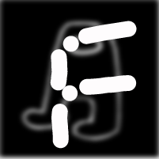

<div align="center">
  <h1>Fiadelity</h1>
  <h3>A sussy Minecraft server software</h3>
  <h4><b>This project is experimental, its usage in production environment is discouraged if you are not ready to face possible bugs.</b></h4>

[](https://github.com/KurumiFake/Fiadelity/actions)
</div>

## What this is

1.17.1 [Airplane](https://airplane.gg) with some patches copy pasted from:
* [JettPack](https://gitlab.com/Titaniumtown/JettPack)
* [Akarin](https://github.com/Akarin-project/Akarin/)
* [Patina](https://github.com/PatinaMC/Patina)
* [Yatopia](https://github.com/YatopiaMC/Yatopia)
* [EmpireCraft](https://github.com/starlis/empirecraft)
* [Pufferfish](https://github.com/pufferfish-gg/Pufferfish)
* [Obscurity](https://github.com/RedeObscurity/Obscurity)
* [Origami](https://github.com/Minebench/Origami)
* [Mirai](https://github.com/etil2jz/Mirai)
* [Sugarcane](https://github.com/SugarcaneMC/Sugarcane)
* [Purpur](https://github.com/PurpurMC/Purpur)
* [Slice](https://github.com/Cryptite/Slice)
* [AtelierMC](https://github.com/AtelierMC/AtelierMC)

Has some optimizations from [Lithium](https://github.com/jellysquid3/lithium-fabric) and [Hydrogen](https://github.com/CaffeineMC/hydrogen-fabric) (JettPack's port), [C2ME](https://github.com/RelativityMC/C2ME-fabric) (Mirai's port)

## Downloads

The latest JAR file can be downloaded from the [GitHub CI](https://github.com/KurumiFake/Fiadelity/raw/releases/1.17.1/Fiadelity-1.17.1-R0.1-SNAPSHOT.jar). You can also clone this repository and build it yourself.

**Builds require at least Java 16!**

If you are interested in making a fork, check out this template [there](https://github.com/PaperMC/paperweight-examples)!

## Building

In order to distribute and use this server software, you need a paperclip file:

```bash
./gradlew clean applyPatches && ./gradlew paperclipJar
```

## License
Patches are licensed under GPL-3.0 unless otherwise noted in the patch headers.
All other files are licensed under MIT.
